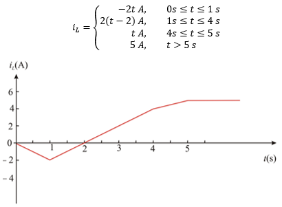
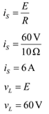
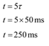
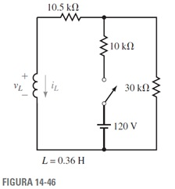

# Informe Tarea N°7

**Integrantes:**

Christian Bonifaz, Mateo Calderon, Josue Camacho, Luis Guevara

**NRC:** 5415

**Docente:** Ing. Darwin Alulema

**Tema:** Capitulo 13 (Inductancia e inductores) y capitulo 14 (Transitorios inductivos) de Análisis de Circuitos - Robbins, Miller

### 1. OBJETIVOS

- Clarificar el estudio de la inductancia e inductores además de los transitorios inductivos todo esto aplicando los conocimientos aprendidos durante clases.

- 
### 2. MARCO TEÓRICO

#### Capitulo 13 (Inductancia e inductores)

#### Capitulo 14 (Transitorios inductivos)

### 3. EXPLICACIÓN Y RESOLUCIÓN DE EJERCICIOS O PROBLEMAS

#### Capitulo 13 (Inductancia e inductores)

1. Si el flujo que enlaza una bobina de 75 vueltas (figura 13-29) cambia a la tasa de 3 Wb/s, ¿cuál es el voltaje en la bobina? 

3. El flujo que cambia a una tasa uniforme por 1 ms induce 60 V en una bobina. ¿Cuál es el voltaje inducido si el mismo cambio de flujo ocurre en 0,01s?

5. La corriente en un inductor de 75 mH (figura 13-30) cambia uniformemente por 200 µA en 0.1 ms. ¿Cuál es el voltaje en él? 

7. El voltaje inducido cuando la corriente cambia de forma uniforme de 3 a 5 amperes en un inductor de 10 H es de 180 volts. ¿Cuánto tiempo pasará para que la corriente cambie de 3 a 5 amperes? 

9. Calcule la inductancia de la bobina de núcleo de aire de la figura 13-31, si l=20 cm, N=200 vueltas, y d=2 cm. 

11. El inductor de núcleo de hierro de la figura 13-32 tiene un núcleo de alta permeabilidad. Por ello, por medio de la ley de Ampere, NI≅Ha la. Debido a que el espacio de aire predomina, no ocurre la saturación y el flujo del núcleo es proporcional a la corriente, es decir, el enlace de flujo es igual a LI. Adicionalmente, ya que todo el flujo pasa a través de la bobina, el enlace de flujo es igual a Nϕ. Al igualar los dos valores del enlace de flujo y con las ideas del capítulo 12, demuestre que la inductancia de la bobina es:

13. La figura 13-34 muestra la corriente en una bobina. Si el voltaje de 0 a 2 ms es de 100 volts, ¿qué valor tiene L?

15. La figura 13-36 muestra la gráfica del voltaje en una inductancia. Los cambios en la corriente de 4 a 5 A durante el intervalo de tiempo de 4 a 5 s.

a. ¿Qué valor tiene L? 

b. Determine la forma de onda de la corriente y grafíquela. 

c. ¿Cuál es la corriente en t 10 s? 

17. ¿Cuál es la inductancia equivalente de 12, 14, 22, y 36 mH conectados en serie?

#### Capitulo 14 (Transitorios inductivos)

***1. a. ¿A qué se parece un inductor que no conduce corriente en el instante que se acciona el interruptor?***

Circuito abierto

***b. Para cada circuito de la figura 14-37, determine iS y vL inmediatamente después de que el interruptor se cierra.***

Ejercicio a

Ejercicio b

Ejercicio c

Ejercicio d

***3. Repita el problema 2 si L1 se reemplaza con un capacitor descargado.***

***5. El interruptor de la figura 14-39 está cerrado en t=0 s.***

***a. ¿Cuál es la constante de tiempo del circuito?***

***b. ¿Cuánto tiempo pasa hasta que la corriente alcanza su valor estable?***

***c. Determine las ecuaciones para iL y vL.***

***d. Calcule los valores para iL y vL a intervalos de una constante de tiempo desde t=0 hasta 5𝞃.***

***7. Repita el problema 5 para el circuito de la figura 14-41 con L =4 H.***

***a. ¿Cuál es la constante de tiempo del circuito?***

***b. ¿Cuánto tiempo pasa hasta que la corriente alcanza su valor estable?***

***c. Determine las ecuaciones para iL y vL.***

***d. Calcule los valores para iL y vL a intervalos de una constante de tiempo desde t=0 hasta 5𝞃.***

***9. Cierre el interruptor en t=0 s y determine las ecuaciones para iL y vL para el circuito de la figura 14-42. Calcule iL y vL en t =3.4 ms.***

***11. Para el circuito de la figura 14-1(b), el voltaje en la inductancia en el instante en que el interruptor se cierra es 80 V, la corriente final de estado estable es 4 A, y el transitorio dura 0.5 s. Determine E, R y L.***

***13. Para la figura 14-1(b), si vL=40e^2000t  V y la corriente de estado estable es 10 mA, ¿cuáles son los valores de E, R y L?***

***15. Para la figura 14-43, R1=20Ω , R2=230Ω  y L=0.5 H y la corriente del inductor ha alcanzado un valor estable de 5 A con el interruptor cerrado. En t=0 s, el interruptor se abre.***

***a. ¿Cuál es la constante de tiempo en la fase de disminución?***

***b. Determine las ecuaciones para iL y vL.***

***c. Calcule los valores para iL y vL a intervalos de una constante de tiempo desde t=0 hasta 5 𝞃.***

***d. Grafique iL y vL. Marque el eje en 𝞃 y en segundos.***

***17. Dado vL=2700 Ve^100t. Use la curva universal de la constante de tiempo para determinar vL en t=20 ms.***

***19. Para la figura 14-43, L=20 H. La corriente durante la fase de crecimiento y disminución se muestra en la figura 14-44. Determine R1 y R2.***

***21. Para la bobina de la figura 14-45 Rl=1.7  y L=150 mH. Determine la corriente de la bobina en t=18.4 ms.***

***23. Para la figura 14-46, el circuito ha alcanzado el estado estable con el interruptor cerrado. Ahora se abre el interruptor.***

***a. Determine la constante de tiempo del circuito desenergizado.***

***b. Determine las ecuaciones para iL y vL.***

***c. Encuentre el voltaje en el inductor y la corriente a través de él en t=17.8s, use las ecuaciones que se determinaron antes.***

***25. a. Repita el problema 22, partes (a) y (b) para el circuito de la figura 14-47.***

***b. ¿Cuánto es iL y vL en t=25 ms?***

***27. Un circuito desconocido que contiene fuentes cd y resistores tiene un voltaje a circuito abierto de 45 volts. Cuando sus terminales de salida se ponen en corto, la corriente de cortocircuito es 0.15 A. Un interruptor, resistor e inductancia están conectados (figura 14-48). Determine la corriente y el voltaje del inductor, 2.5 ms después que el interruptor se ha cerrado.***

### 4. VIDEO

### 5. CONCLUSIONES 

### 6. BIBLIOGRAFÍA

Robbins, A., & Miller, W. (2008). Análisis de circuitos. Estados Unidos: Cengage Learning.
